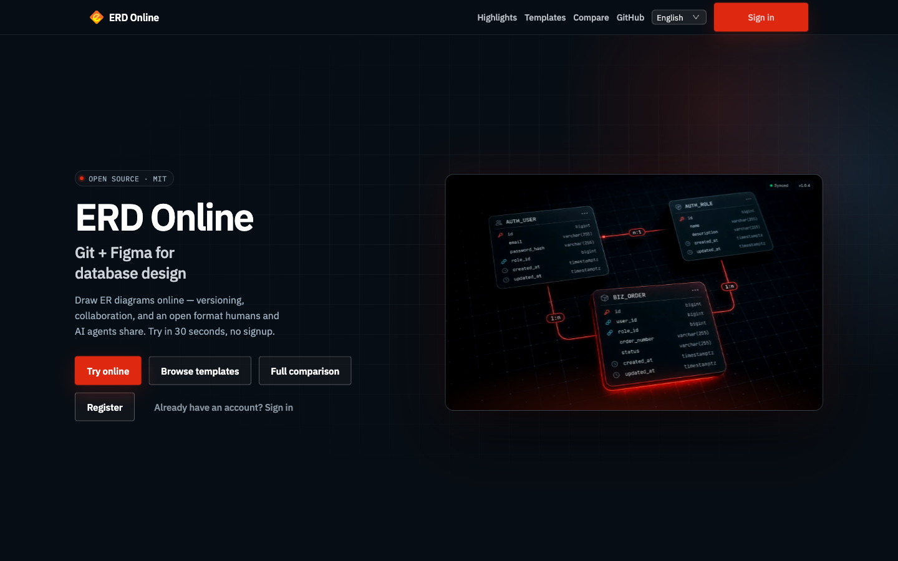

<p align="center">
  
</p>

<h1 align="center">ERD Online</h1>

<p align="center"><strong>The Git + Figma for database design.</strong><br/>Version control and real-time collaboration for your data models — open source and free.</p>

<p align="center">
  <a href="./README.md">简体中文</a> | English
</p>

<p align="center">
  <a href="https://www.erdonline.com/demo"></a>
  <a href="https://www.erdonline.com/compare"></a>
  <a href="https://doc.erdonline.com/"></a>
</p>

<p align="center">
  <a href="https://github.com/erdonline/erdonline/stargazers"></a>
  <a href="./LICENSE"></a>
  
  
  
  <a href="https://github.com/erdonline/erdonline/issues"></a>
</p>

---

<p align="center">
  <a href="https://www.erdonline.com/en/">
    
  </a>
</p>

Most database design tools force a trade-off: **dbdiagram** is pretty but closed, with no versioning or collaboration; **Navicat/PDManer** are powerful but heavy, desktop-only, and single-player; **drawio** is free but doesn't understand databases. **ERD Online fills the empty niche — collaborative database design** — with the two things nobody else open-sources: **a version snapshot + diff on every change**, and **real-time multiplayer editing**.

> **Try it in 30 seconds — no signup:** [**www.erdonline.com/demo**](https://www.erdonline.com/demo) → open the sample project → you're inside a live ER diagram of `user` / `order` tables. Edit a table, save a version, see the diff.

### AI Agent / MCP in 30 seconds

Secondary path — the product is still **Git + Figma for database design**, not ChatSQL. Agents read the **same** `projectJSON` the canvas uses. Demo share links are **not** a PAT.

1. Copy the remote Streamable HTTP URL: `https://api.erdonline.com/mcp`.
2. One-click install in Cursor. The deeplink contains only the URL, never a PAT:

[](https://www.erdonline.com/cursor-mcp/)

> Also works with **Claude Desktop, Claude Code, Cline, Windsurf, and VS Code Copilot**. Their fields differ (`type: http`, `streamableHttp`, `serverUrl`), so use the [six client cards](https://doc.erdonline.com/en/docs/guide/api-and-mcp/).

For account data during the PAT transition, add the Bearer header locally in Cursor user-level `~/.cursor/mcp.json`. OAuth is the next slice:

```json
{
  "mcpServers": {
    "erdonline": {
      "url": "https://api.erdonline.com/mcp",
      "headers": {"Authorization": "Bearer erd_pat_…"}
    }
  }
}
```

Never put a plaintext PAT in a deeplink or commit. Self-host fallback runs `node mcp/dist/index.js` from source (the npm package is not published). Full steps: [English](https://doc.erdonline.com/en/docs/guide/api-and-mcp/) · [中文](https://doc.erdonline.com/docs/guide/api-and-mcp/). Reload MCP and ask: `List my ERD projects`. Propose changes with `create_version`, then review the diff. API 200 is **not** human approval.

## Why ERD Online

- **Wow in 30 seconds** — the no-login demo drops you straight into a real ER diagram (ReactFlow canvas), not a blank page.
- **You won't want to leave** — every change auto-creates a version you can diff and restore; teammates edit the same diagram live. Versioning + collaboration are the lock-in.
- **A codebase you'll enjoy contributing to** — modern stack (React 18 + UmiJS Max + TypeScript, Spring Boot 3.5 + JDK 17), one-command Docker bring-up, and an open `projectJSON` + public API/MCP so humans *and* AI agents read/write the same source of truth.

## How it compares

[Full comparison → www.erdonline.com/compare](https://www.erdonline.com/compare)

| | ERD Online | dbdiagram.io | Navicat / PDManer | drawio |
|---|:---:|:---:|:---:|:---:|
| Open source & free | ✅ MIT | ❌ | ❌ | ✅ |
| Version snapshot + diff | ✅ | ❌ | ⚠️ manual | ❌ |
| Real-time collaboration | ✅ | ❌ | ❌ | ⚠️ |
| DB-aware (forward/reverse) | ✅ | ⚠️ | ✅ | ❌ |
| Team roles & permissions | ✅ 3-tier | ❌ | ⚠️ | ❌ |
| Self-hostable | ✅ 1 command | ❌ | ❌ | ✅ |
| Open API / MCP for AI agents | ✅ | ❌ | ❌ | ❌ |

## ✨ Features

- 📡 **Version control** — snapshot every change, diff and restore any version
- 🌱 **Real-time collaboration** — three-tier roles (owner / admin / member), element-level permissions
- 🎨 **Relationship diagramming** — ReactFlow canvas built for readable, "share-worthy" diagrams
- 🏷 **Metadata management** — design table structures online, forward-sync to databases
- 🔎 **Reverse engineering** — parse existing databases back into the platform
- 📱 **Multi-datasource** — MySQL, Oracle, DB2, SqlServer, PostgreSQL
- 🎉 **Doc export** — one-click export to Word / HTML / Markdown
- 💯 **Online SQL** — read-only whitelist queries, execution plans, history
- 🤝 **Open API + MCP** — PAT / OAuth2; agents are first-class citizens of `projectJSON`

## 🚀 Quick Start

### Option 1 — Docker Compose (recommended)

```bash
git clone https://github.com/erdonline/erdonline erd-online && cd erd-online
cp .env.example .env          # tweak ports / passwords
docker compose up -d          # mysql + redis + backend + frontend
```

Then open:

- Frontend: http://localhost:8000  (default login `admin` / `123456`)
- No-login demo: http://localhost:8000/demo
- Backend API: http://localhost:9502

### Option 2 — Local development

Prerequisites: **JDK 17**, Maven 3.8+, **Node.js 20**, Yarn, MySQL 8, Redis.

```bash
docker compose up -d mysql redis         # 1. databases
cd backend && SPRING_PROFILES_ACTIVE=dev mvn spring-boot:run   # 2. backend (:9502)
cd frontend && yarn && yarn start        # 3. frontend (:8000), in another terminal
```

## 🏗 Tech Stack

| Layer | Technology |
|---|---|
| Frontend | React 18 · UmiJS Max · Ant Design · Zustand · TypeScript · ReactFlow |
| Backend | Spring Boot 3.5 · JWT Resource Server · MyBatis-Plus · Redis |
| Storage | MySQL 8 · Redis |
| Deploy | Docker · Docker Compose · Nginx |

## 📖 Documentation

Published docs: [doc.erdonline.com](https://doc.erdonline.com/) — [Architecture](https://doc.erdonline.com/docs/architecture) · [Deployment](https://doc.erdonline.com/docs/deployment) · [Development](https://doc.erdonline.com/docs/development) · [MCP for Cursor](https://doc.erdonline.com/en/docs/guide/api-and-mcp/)

## 🤝 Contributing

Contributions are welcome, and **good first issues** are labeled for newcomers. Please read the [Contributing Guide](CONTRIBUTING.md) and [Code of Conduct](CODE_OF_CONDUCT.md). Modern stack, one-command dev environment, and CI-gated quality make it easy to land your first PR.

**If ERD Online is useful to you, please [⭐ star the repo](https://github.com/erdonline/erdonline) — it's the fuel that keeps an open-source project alive.**

## 📄 License

Released under the [MIT License](LICENSE).

## 🙏 Acknowledgements

- Frontend derived from [ERD-Online](https://www.erdonline.com/)
- Backend refactored from the Martin microservice scaffold into a monolith
